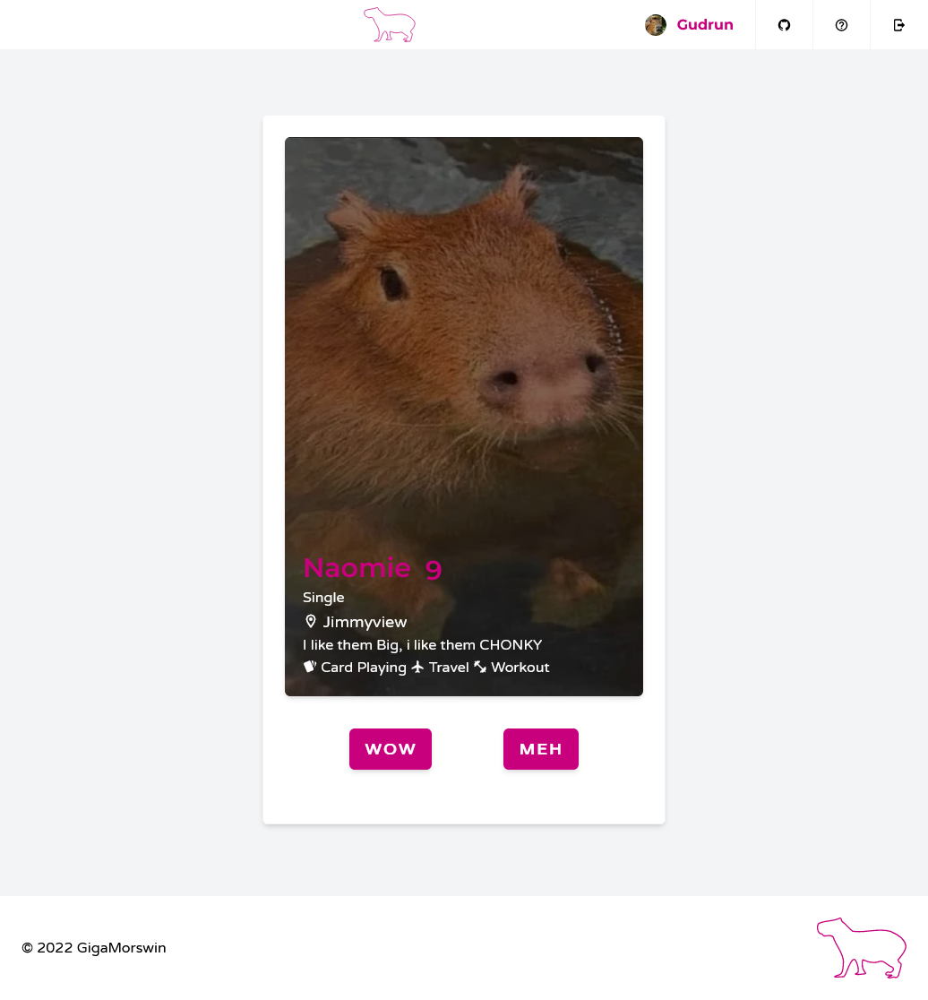
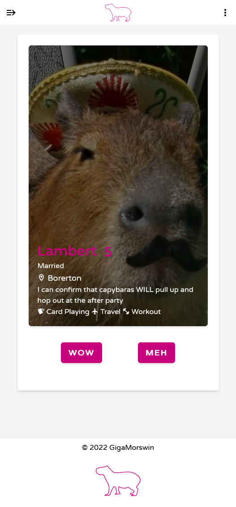
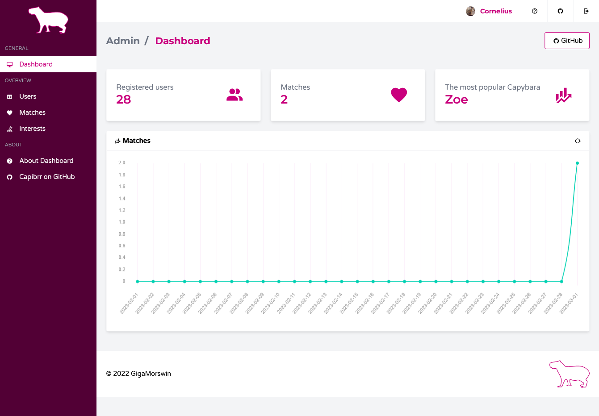
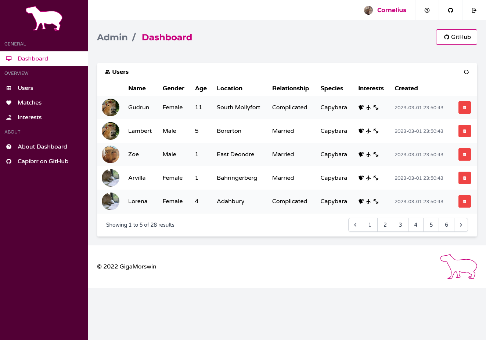

# Capybrr - Laravel Dating app for Capybaras

Laravel app Capybrr allows you to meet new capybaras of the opposite sex, their profiles, profile pictures, descriptions and interests. The dating app only allows contact information to be shared between interested couples. The administrator has the ability to supervise, edit and collect statistical information on the portal.

# Project assumptions

1. Getting to know the possibilities of the Laravel framework.

# Features

### Guest:

- Create a new profile
- Login

### User:

- Modification of basic personal data
- Modification of login data
- Modification of interests
- Randomizing and learning user profiles
- User like function
- Overview of matchedusers and likedusers
- Deleting previously added pairs of liked users

### Administrator:

- Access to portal statistics
- Access to all users and deletion
- Access to all some users and deletion
- Viewing, adding, editing interests made available to users

# Installation requirements:

- PHP 7.4 (PHP 7.4 recommended, tested up to 8.1.6)
- Composer
- DatabaseMariaDb/MySql

# Installation:

1. Create an empty database with accesses that match the .env file
    
2. According to.env.example, we create database mysql/mariadb "capibrr" with login login
    

"root" without a password

1. If the server uses a PHP version higher than 7.4, e.g. 8.0.6, edit the composer.json file in the eighth line of code as follows:

__"php":__">=7"_

After this action, you need to run the command:

_composer__update_

More details:

[https://getcomposer.org/doc/01-basic-usage.md](https://getcomposer.org/doc/01-basic-usage.md)

1. Using the composer, install the dependencies in the folder of the cloned application:

_composer **install** --no-interaction_

1. Then make a copy of the.env file from the.env.example file and configure it for your needs
    
2. Then run the following commands to load sample data into the application:
    

_php artisan migrate **php** artisan__db:seed_

1. Execute the following command to generate symbolic links:

_php **artisan** storage:link_

1. Then start the server:

_php **artisan** serve_

Configuration parameters, including login details for the administrator account, default login details for generated users, database connection details are in the.env file

# Technologies

## PHP:

- PHP 7.4 (PHP 7.4 recommended, tested up to 8.1.6)
- Laravel 9.10.0 [https://laravel.com/](https://laravel.com/)
- MariaDB 10.4.24 + PhpMyAdmin5.2.0 (xampp)

## CSS:

- TailwindCss 3.1.2 +PostCSSsupported by BundlerLaravelMix 
- Material Designs Icons [https://materialdesignicons.com/](https://materialdesignicons.com/)
- Google Fonts [https://fonts.google.com/](https://fonts.google.com/)

## Js dependencies:

- JQuery 3.6.0: (for laravel-jsvalidation) [https://jquery.com/](https://jquery.com/)

## Php Dependencies:

- Laravel/Breeze: 1.9 [https://github.com/laravel/breeze](https://github.com/laravel/breeze)
- blade-ui-kit/blade-icons: 1.3 [https://blade-ui-kit.com/](https://blade-ui-kit.com/)
- fakerphp/faker: 1.9.1 [https://fakerphp.github.io/](https://fakerphp.github.io/)
- proengsoft/laravel-jsvalidation: 4.7 [https://github.com/proengsoft/laravel-jsvalidation](https://github.com/proengsoft/laravel-jsvalidation)
- laravel-debugbar: 3.6 [https://github.com/barryvdh/laravel-debugbar](https://github.com/barryvdh/laravel-debugbar)
-  PhpMyAdmin 5.2.0 (Xampp)[https://www.apachefriends.org/pl/index.html](https://www.apachefriends.org/pl/index.html)
